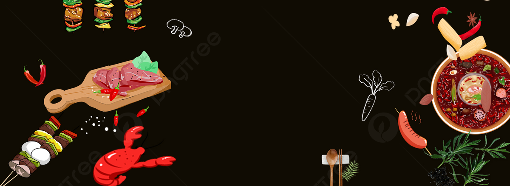
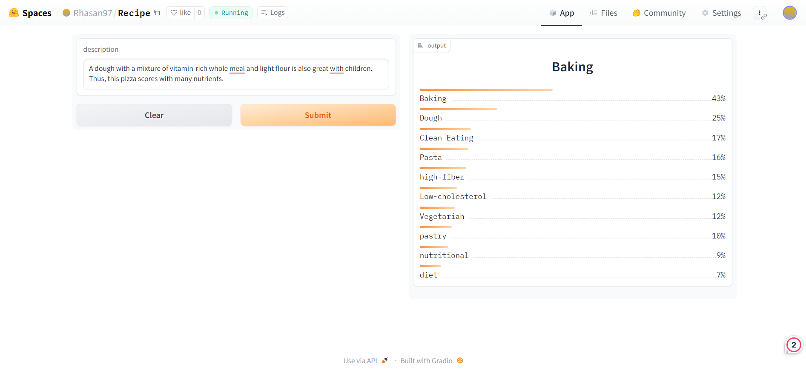

# Recipe-classifier

A text classification model from data collection, model training, and deployment. The model can classify 55 different types of food types. The keys of `Recipe\recipe_types_encoded19.json` shows the food types

## Data Collection

Data was collected from recipe details Website Listing: https://eatsmarter.com/ 
The data collection process is divided into 2 steps:

1. **Recipe URL Scraping:** The recipe urls were scraped with `Scraper\Urls\scp.py` and the urls are stored along with recipe titles in `scraper\Url_data`
2. **Book Details Scraping:** Using the urls, recipe description and types are scraped with `scraper\Details\details_scp.py` and they are stored in `data\Details_data`

In total, I scraped 27,313 recipe details and cleaned the data with `scraper\Cleaning\clean.py` to get the final data.

## Data Preprocessing

Initially there were *1025* different food types in the dataset. After some analysis, I found out *940* of them are rare. So, I removed those types and then I have *55* types. After that, I removed the description without any types resulting in *27,313* samples.

## Model Training

Finetuned a `roberta-base` model from HuggingFace Transformers using Fastai and Blurr. The model training notebook can be viewed [here](https://github.com/RHasan97/Recipe-classifier/blob/main/Notebooks/Recipe_classifier.ipynb). The other models have also performed well and their performances are provided below.

**Models Performance:**
| Models          | Multilabel Accuracy Score(%)  |
|:----------------:|:----------------:|
| distilroberta-base|       93.7        |
| distilbert-base-cased| 93.6    | 
| roberta-base  | 93.8 | 
| albert-base-v2    | 93.4   |
| klue/bert-base    | 93.5   |
| microsoft/deberta-base  | 93.2   |
| bert-base-uncased  | 93.5   |
## Model Compression and ONNX Inference

The trained model has a memory of 300+MB. I compressed this model using ONNX quantization and brought it under 80MB. 

## Model Deployment

The model is deployed to HuggingFace Spaces Gradio App. The implementation can be found in `Recipe` folder or [here](https://huggingface.co/spaces/Rhasan97/Recipe) 

## Web Deployment
Deployed a Flask App built to take descprition and show the genres as output. Check `flask ` branch. The website is live [here](https://recipe-classifier-7lb6.onrender.com/) 

